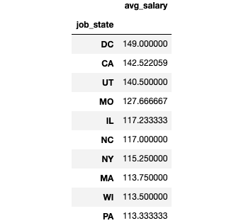

# Data Science Wage Prediction 2020 (During Crisis)

* Developed an instrument to estimates Data Scientists wages (MAE ~ $ 11K) to serve as a wage comparator when negotiating the pay.
* Used Selenium and Chromdriver to scraped over 1000 job descriptions on from Glassdoor.
* Quantified technical requirements from skills requirements and emphasize placed on Python, Excel, AES & Spark. 
* Tested the mode on Lasso, Random forest, Linear regression using GridsearchCV to find the best fit  
* Developed front end API using flask 

## Packages & Tool Kit
**Packages:** Pandas, Numpy, Sklearn, Matplotlib, Seaborn, Flask,
**Web Framework:** ```pip install -r requirements.txt``` 


## Resources & References

**Front End Production Flask:** https://towardsdatascience.com/productionize-a-machine-learning-model-with-flask-and-heroku-8201260503d2

**Github:**

https://github.com/arapfaik/scraping-glassdoor-selenium

https://github.com/PlayingNumbers


## EDA Result


